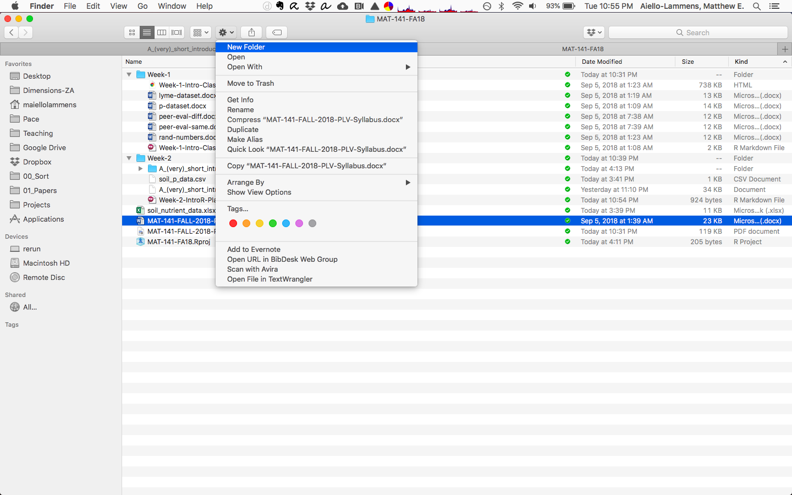

# Getting started in RStudio

Go back to your open RStudio window, and have a look at the components there.

### Overall layout

There are four panels in the RStudio interface (though you may only have three open when you first start it), each has valuable information.

* Console / Terminal panel (lower-left)
* Environment / History / Git (upper-right)
* Files / Plots / Packages / Help (lower-right)
* Source / Editor (upper-left)

### File management

Before we do anything in R/RStudio, let's make a new folder on our computers where our class data can reside.
You can use your operating systems file manager (i.e., Finder on Mac and Windows Explorer on Windows) to created a new folder where ever suites you. 
**Call this new folder `MAT-141-FA19`.**
We'll use this folder/directory later when we are asked to set our 'working directory' and when we need a place to store `*.R` and `*.Rmd` files.

See the screen shot below for an example of creating a new folder using Mac Finder.



### Making an R Project

Let's make a new R Project associated with your `MAT-141-FA19` directory. 
It will become more clear why we are doing this later when we get to the Git lesson.
To make a new project, got to the upper right-hand side of the RStudio interface, where it says **Project: (None)**.
Click the little downward arrow, select "New Project", then select "Existing Directory" from the window that pops up. 
Use the graphical user interface (GUI) to navigate to the `MAT-141-FA19` directory, then select "Create Project".


## R script file

Use a script file for your work. It's easier to go back to and easy to document.

**Important:** within an R file, you can use the # sign to add comments. Anything written after the # is *not* interpreted when you run the code.

**Challenge**

Create a new R script file in your `MAT-141-FA19` directory.

***

### Basic file managment in R (OPTIONAL)

```{r}
# What working directory am I in?
getwd()

# Move to a different director?
setwd(".")
```

#### Things to cover

* Navigating the file path
* Tab completion of file paths
* Tab completion of R commands

**Challenge**

* Try to auto-complete `fil`, what do you find?
* Use the brief help menu that comes up to find a function that starts with `file`, and describe what you think it does.

***

## Rmd file

Use this to integrate text and R code into the same document.

Create a new Rmd file. 

*Practice with Rmd file*

