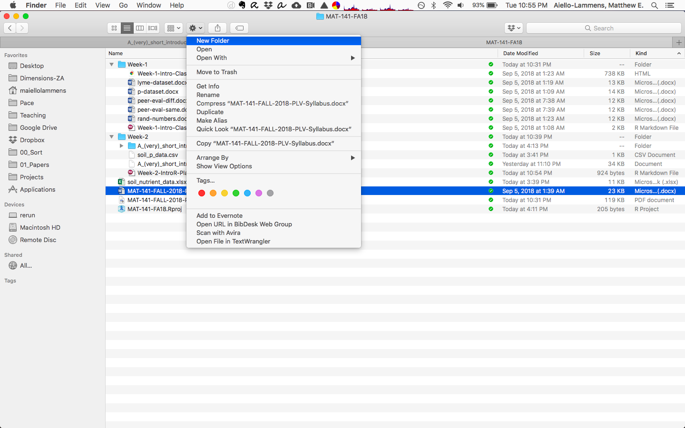

# Getting started in RStudio

Let's start by opening up RStudio. Have a look at the components here.

### Overall layout

There are four panels in the RStudio interface (though you may only have three open when you first start it), each has valuable information.

* Console / Terminal panel (lower-left)
* Environment / History / Git (upper-right)
* Files / Plots / Packages / Help (lower-right)
* Source / Editor (upper-left)

### File management

Before we do anything in R/RStudio, let's make a new folder on our computers where our class data can reside.
You can use your operating systems file manager (i.e., Finder on Mac and Windows Explorer on Windows) to created a new folder where ever suites you. 
**Call this new folder `MAT-141-FA20`. I STRONGLY RECOMMEND THAT YOU DO NOT PUT THIS FOLDER ON YOUR DESKTOP.**
We'll use this folder/directory later when we are asked to set our 'working directory' and when we need a place to store `*.R` and `*.Rmd` files.

See the screen shot below for an example of creating a new folder using Mac Finder.



### Making an R Project

Go back to RStudio.
Let's make a new R Project associated with your `MAT-141-FA20` directory. 
To make a new project, go to the upper right-hand side of the RStudio interface, where it says **Project: (None)**.
Click the little downward arrow, select "New Project", then select "Existing Directory" from the window that pops up. 
Use the graphical user interface (GUI) to navigate to the `MAT-141-FA20` directory, then select "Create Project".
Once you've created your project, your RStudio session will restart in this project.

There is also now a file in the folder you just made that ends in *.Rproj.
If you double click on this file, RStudio will open, openning this project at the same time.
This is a good way to re-open RStudio for your next session.

## R as calculator

We can use R just like any other calculator. 
Go to the **Console** tab and type the following and press enter:

```{r}
3 + 5
```

You should see the value of the equation "spit out" below the text you wrote.

We can execute any/all of the commands and functions we will learn this semester in the console, but this is generally *not* what we will do.


## R script file

Best practice for using R is to store your work in an R script or an RMarkdown document.
We use these because it's easier to go back and re-run our code and to document our analytical steps / process.

**Important:** within an R file, you can use the `#` sign to add comments. Anything written after the `#` is *not* interpreted when you run the code.

**Important:** we can write commands in our R script file, then run/execute those commands by pressing `CMD` + `RETURN` (Macs) or `CNTR` + `RETURN` (Windows). We can also excute only a section of code by highlighting it and pressing these same key strokes.


**Challenge**

Create a new R script file in your `MAT-141-FA20` directory. **HINT:** Try the little green `+` sign in the upper left-hand corner of RStudio.


## Rmd file

Use this to integrate text and R code into the same document.

**Challenge**

Download the `Analysis-Writeup-1-SoilP-Example.Rmd` file from our Classes page. 
Move this file into your `MAT-141-FA20` folder.
In RStudio, you can now open this file using the **Files** tab (lower-right).
Before we do anything else, `Knit` the document using the `Knit` icon.
**NOTE:** the first time you do this, your system may prompt you to install the `knitr` package. 
Say yes, as you will need this package for the rest of the semester.


